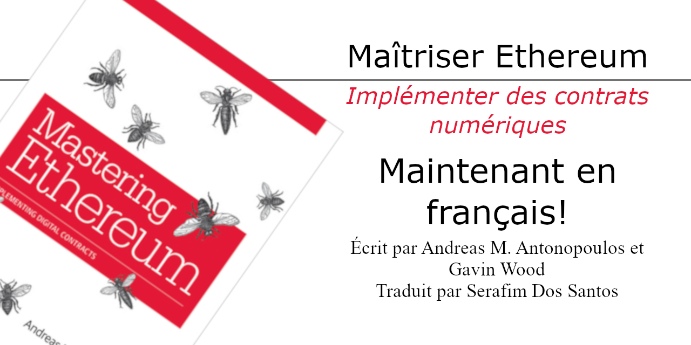

# Maîtriser Ethereum : Implémenter des contrats numériques, 1ère édition ouverte

Le livre **Maîtriser Ethereum** (_**Mastering Ethereum**_ par O'Reilly Media) tel qu'écrit originalement en anglais par _Andreas M. Antonopoulos_ et _Gavin Wood_, traduit en français (Canada) par _Google Translate API_ et révisé par _Serafim Dos Santos_ avec les termes du [Grand dictionnaire terminologique (GDT)](https://gdt.oqlf.gouv.qc.ca/) de l'[Office qu&eacute;b&eacute;cois de la langue fran&ccedil;aise](https://www.oqlf.gouv.qc.ca/).

---

---

<h2><em>Mastering Ethereum</em></h2>
<blockquote> 

La source originale de ces textes est tiré du livre à édition ouverte <strong>Mastering Ethereum</strong> par <em>Andreas M. Antonopoulos</em> et <em>Gavin Wood</em> accessible sur GitHub

👉 <a href="https://github.com/ethereumbook/ethereumbook">github.com/ethereumbook/ethereumbook</a> 👈

Ευχαριστώ Ανδρέα!
 
</blockquote>

<pre>
! ! !
!!!!!!!!!!!!!!!!!!!!!!!!!!!!!!!!!!!!!!!!!!
!!!   CE PROJET EST EN DÉVELOPPEMENT   !!!
!!!!!!!!!!!!!!!!!!!!!!!!!!!!!!!!!!!!!!!!!!
! ! !
</pre>

Pour un don ou me payer un café :

bitcoin:bc1qgal2khvhktyqaj99etxmtd6m6xhv72ht0zvhtx

ETH : serafdossantos.eth

## Feuille de route
* Traduction
  - [ ] Phase de traduction (DONE1) : en cours...
  - [ ] Phase de révision (DONE2) : en attente
  - [ ] Phase de conclusion (DONEF) : en attente
* Révision
  - [ ] Phase de révision externe

<h1>Ma&icirc;triser Ethereum</h1>
<h2>Implémenter des contrats numériques</h2>
<h3>1ère édition ouverte</h3>

Auteurs : <strong>Andreas M. Antonopoulos</strong> et <strong>Gavin Wood</strong>  
Traducteur : <strong>Serafim Dos Santos</strong>

---
1. [Préface](html/for_translation_ethereumbook_preface_open_editiontxt_fr_CA.html)
2. [Glossaire rapide](html/for_translation_ethereumbook_glossarytxt_fr_CA.html)
3. [Chapitre 1](html/for_translation_ethereumbook_01what-istxt_fr_CA.html)
4. [Chapitre 2](html/for_translation_ethereumbook_02introtxt_fr_CA.html)
5. [Chapitre 3](html/for_translation_ethereumbook_03clientstxt_fr_CA.html)
6. [Chapitre 4](html/for_translation_ethereumbook_04keys-addressestxt_fr_CA.html)
7. [Chapitre 5](html/for_translation_ethereumbook_05walletstxt_fr_CA.html)
8. [Chapitre 6](html/for_translation_ethereumbook_06transactionstxt_fr_CA.html)
9. [Chapitre 7](html/for_translation_ethereumbook_07smart-contracts-soliditytxt_fr_CA.html)
10. [Chapitre 8](html/for_translation_ethereumbook_08smart-contracts-vypertxt_fr_CA.html)
11. [Chapitre 9](html/for_translation_ethereumbook_09smart-contracts-securitytxt_fr_CA.html)
12. [Chapitre 10](html/for_translation_ethereumbook_10tokenstxt_fr_CA.html)
13. [Chapitre 11](html/for_translation_ethereumbook_11oraclestxt_fr_CA.html)
14. [Chapitre 12](html/for_translation_ethereumbook_12dappstxt_fr_CA.html)
14. [Chapitre 13](html/for_translation_ethereumbook_13evmtxt_fr_CA.html)
14. [Chapitre 14](html/for_translation_ethereumbook_14consensustxt_fr_CA.html)
15. [Annexe A](html/for_translation_ethereumbook_appdx-forks-historytxt_fr_CA.html)
16. [Annexe B](html/for_translation_ethereumbook_appdx-standards-eip-erctxt_fr_CA.html)
17. [Annexe C](html/for_use_ethereumbook_appdx-evm-opcodes-gastxt_fr_CA.html)
18. [Annexe D](html/for_translation_ethereumbook_appdx-dev-toolstxt_fr_CA.html)
19. [Annexe E](html/for_translation_ethereumbook_appdx-web3js-tutorialtxt_fr_CA.html)

---
## Translations
If you are interested in translating this book, please join a team of volunteers at [www.transifex.com/aantonop/ethereumbook/](https://www.transifex.com/aantonop/ethereumbook/)
Free copies of "Mastering Bitcoin Open Edition", translated in many languages, can be downloaded from [ethereumbook.info](https://bitcoinbook.info)

---
 Cette œuvre est mise à disposition selon les termes de la <a rel="license" href="http://creativecommons.org/licenses/by-sa/4.0/">Licence Creative Commons Attribution -  Partage dans les Mêmes Conditions 4.0 International</a>.
