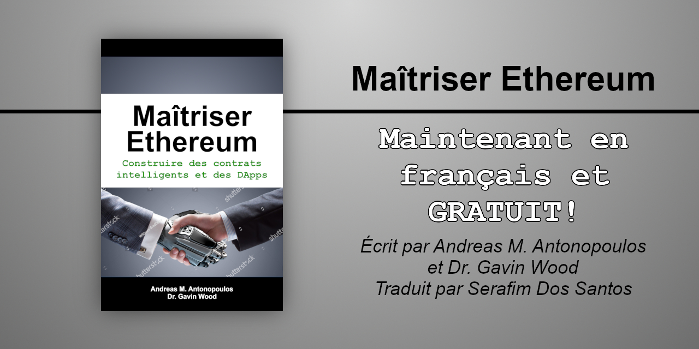

# Maîtriser Ethereum : Construire des contrats intelligents et des DApps, 1ère édition ouverte

Le livre **Maîtriser Ethereum** (_**Mastering Ethereum**_ par O'Reilly Media) tel qu'écrit originalement en anglais par _Andreas M. Antonopoulos_ et _Dr. Gavin Wood_, traduit en français (Canada) par _Google Translate API_ et révisé par _Serafim Dos Santos_ avec les termes du [Grand dictionnaire terminologique (GDT)](https://gdt.oqlf.gouv.qc.ca/) de l'[Office québécois de la langue française](https://www.oqlf.gouv.qc.ca/).

---

<!-- center>

<h2><em>Mastering Ethereum</em></h2>
<blockquote> 

La source originale de ces textes est tiré du livre à édition ouverte <strong>Mastering Ethereum</strong> par <em>Andreas M. Antonopoulos</em> et <em>Dr. Gavin Wood</em> accessible sur GitHub

👉 <a href="https://github.com/ethereumbook/ethereumbook">github.com/ethereumbook/ethereumbook</a> 👈

Ευχαριστώ Ανδρέα! 
Thank you Dr. Gavin!
 
</blockquote>

<pre>
! ! !
!!!!!!!!!!!!!!!!!!!!!!!!!!!!!!!!!!!!!!!!!!
!!!   CE PROJET EST EN DÉVELOPPEMENT   !!!
!!!!!!!!!!!!!!!!!!!!!!!!!!!!!!!!!!!!!!!!!!
! ! !
</pre>

Pour un don ou me payer un café :

bitcoin:bc1qgal2khvhktyqaj99etxmtd6m6xhv72ht0zvhtx

ETH : serafdossantos.eth

## Feuille de route

* Traduction
  - [ ] Phase de traduction (DONE1) : en cours...
  - [ ] Phase de révision (DONE2) : en attente
  - [ ] Phase de conclusion (DONEF) : en attente
* Révision
  - [ ] Phase de révision externe

<h1>Maîtriser Ethereum</h1>
<h2>Construire des contrats intelligents et des DApps</h2>
<h3>1ère édition ouverte</h3>

Auteurs : <strong>Andreas M. Antonopoulos</strong> et <strong>Dr. Gavin Wood</strong>  
Traducteur : <strong>Serafim Dos Santos</strong>

---

1. [Préface](html/for_use_ethereumbook_preface_open_editiontxt_fr_CA.html) 👍
2. [Glossaire rapide](html/for_use_ethereumbook_glossarytxt_fr_CA.html) 👍
3. [Chapitre 1 - Qu&#39;est-ce qu&#39;Ethereum ?](html/for_use_ethereumbook_01what-istxt_fr_CA.html) 👍
4. [Chapitre 2 - Les bases d&#39;Ethereum](html/for_use_ethereumbook_02introtxt_fr_CA.html) 👍
5. [Chapitre 3 - Clients Ethereum](html/for_use_ethereumbook_03clientstxt_fr_CA.html) 👍
6. [Chapitre 4 - Cryptographie](html/for_use_ethereumbook_04keys-addressestxt_fr_CA.html) 👍
7. [Chapitre 5 - Portefeuilles](html/for_use_ethereumbook_05walletstxt_fr_CA.html) 👍
8. [Chapitre 6 - Transactions](html/for_use_ethereumbook_06transactionstxt_fr_CA.html) 👍
9. [Chapitre 7 - Contrats intelligents et Solidity](html/for_use_ethereumbook_07smart-contracts-soliditytxt_fr_CA.html) 👍
10. [Chapitre 8 - Contrats intelligents et Vyper](html/for_use_ethereumbook_08smart-contracts-vypertxt_fr_CA.html) 👍
11. [Chapitre 9 - Sécurité des contrats intelligents](html/for_use_ethereumbook_09smart-contracts-securitytxt_fr_CA.html) 👍
12. [Chapitre 10 - Jetons](html/for_use_ethereumbook_10tokenstxt_fr_CA.html) 👍
13. [Chapitre 11 - Oracles](html/for_use_ethereumbook_11oraclestxt_fr_CA.html) 👍
14. [Chapitre 12 - Applications décentralisées (DApps)](html/for_use_ethereumbook_12dappstxt_fr_CA.html) 👍
15. [Chapitre 13 - La machine virtuelle Ethereum](html/for_use_ethereumbook_13evmtxt_fr_CA.html) 👍
16. [Chapitre 14 - Consensus](html/for_use_ethereumbook_14consensustxt_fr_CA.html) 👍
17. [Annexe A - Historique de la fourche Ethereum](html/for_use_ethereumbook_appdx-forks-historytxt_fr_CA.html) 👍
18. [Annexe B - Normes Ethereum](html/for_use_ethereumbook_appdx-standards-eip-erctxt_fr_CA.html) 👍
19. [Annexe C - Opcodes Ethereum EVM et consommation de gaz](html/for_use_ethereumbook_appdx-evm-opcodes-gastxt_fr_CA.html) 👍
20. [Annexe D - Outils de développement, cadres de développement, et bibliothèques](html/for_use_ethereumbook_appdx-dev-toolstxt_fr_CA.html) 👍
21. [Annexe E - Tutoriel web3.js](html/for_use_ethereumbook_appdx-web3js-tutorialtxt_fr_CA.html) ❌

---

Je n'ai pas référencé les liens entres les documents .adoc (les documents originaux anglais ne sont pas concu pour être disponibles par chapitre). Si vous souhaîtez le livre en une seule page :

!!! ATTENTION : Processus intense !!!

<a href="https://ethereum.maitriser.ca/html/book.html" alt="Livre Maîtriser Bitcoin en une seule page html">Livre en une seule page html</a> ❌

---

L'édition ouverte originale en anglais, en html : [http://www.maitriser.ca/MasteringEthereumBook/](http://www.maitriser.ca/MasteringEthereumBook/)

---

## Translations

If you are interested in translating this book, please join a team of volunteers at [www.transifex.com/aantonop/ethereumbook/](https://www.transifex.com/aantonop/ethereumbook/)
Free copies of "Mastering Bitcoin Open Edition", translated in many languages, can be downloaded from [ethereumbook.info](https://bitcoinbook.info)

---

 Cette œuvre est mise à disposition selon les termes de la <a rel="license" href="http://creativecommons.org/licenses/by-sa/4.0/">Licence Creative Commons Attribution -  Partage dans les Mêmes Conditions 4.0 International</a>.
